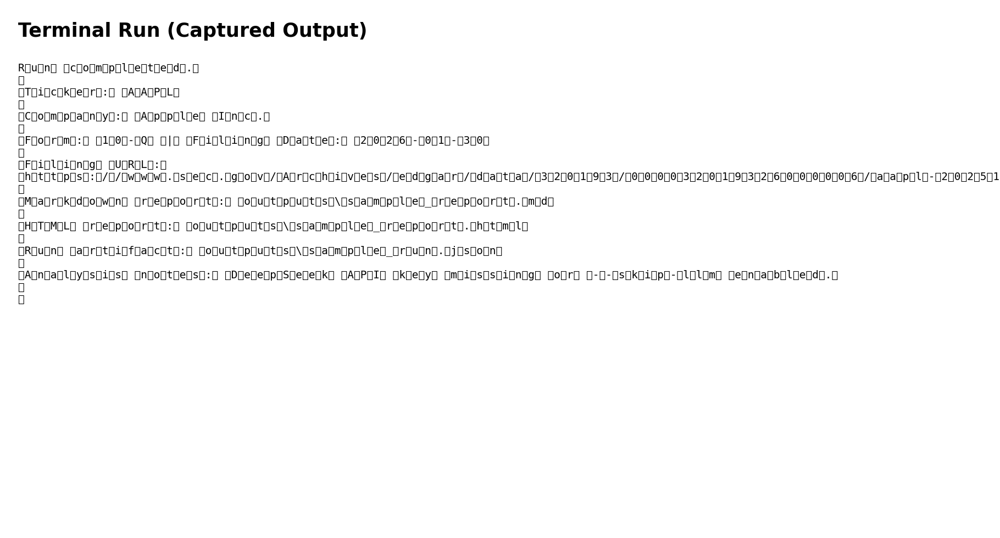
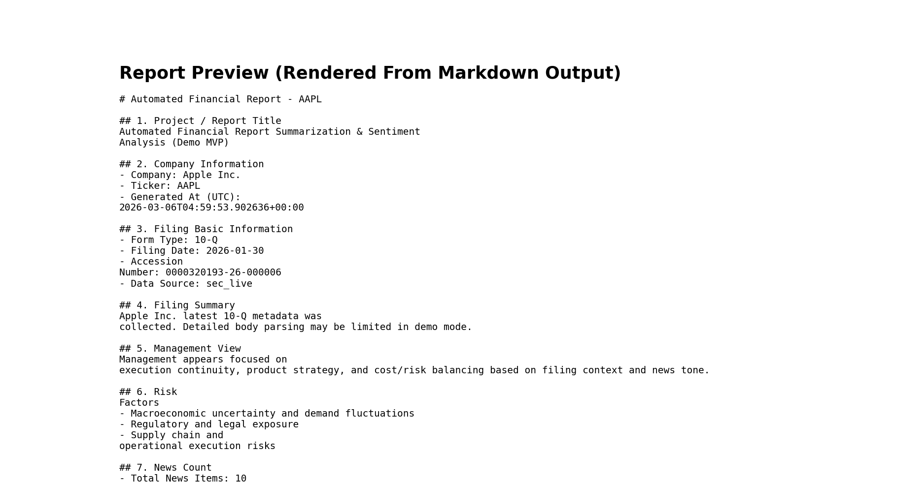
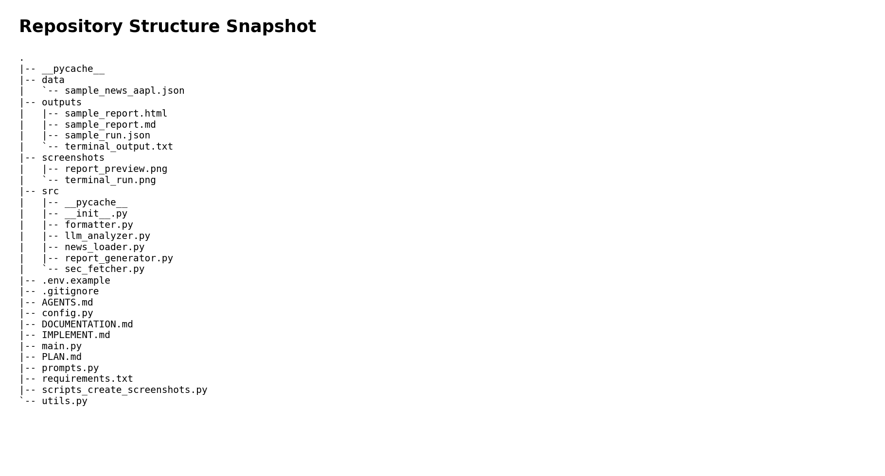

# Automated Financial Report Summarization & Sentiment Analysis Agent

## 1) Project Title
Automated Financial Report Summarization & Sentiment Analysis Agent (Competition Demo MVP)

## 2) Project Overview
This repository provides a runnable CLI MVP that:
- Retrieves latest SEC EDGAR 10-K/10-Q filing information for a ticker (default: AAPL)
- Uses DeepSeek API (or fallback mode) to summarize filing context and analyze sentiment from local news samples
- Generates structured Markdown and HTML reports for presentation/demo use

## 3) Target User and Use Case
- Target users: judges, reviewers, instructors, and teammates evaluating technical feasibility
- Use case: quickly demonstrate a closed-loop workflow from financial filing retrieval to LLM analysis and report generation

## 4) Scope Statement (Demo MVP)
This is a demo-oriented MVP for competition/presentation purposes.
- Data source: SEC public filing endpoints + static local news JSON
- Runtime: local Python CLI
- Goal: prove feasibility and produce clear outputs

Out of scope: Airflow, Docker, database, multi-user systems, real-time alerts, trading integration, live web-scale scraping, heavy deployment stacks.

## 5) Feature List
- Latest 10-K/10-Q filing metadata retrieval from SEC EDGAR
- Optional filing text snippet extraction for analysis context
- Static local news headline loading and validation
- DeepSeek-compatible summarization/sentiment analysis integration
- Graceful fallback analysis when API key/network is unavailable
- Auto-generation of:
  - `outputs/sample_report.md`
  - `outputs/sample_report.html`
  - `outputs/sample_run.json`

## 6) System Flow
1. User runs `python main.py --ticker AAPL`
2. Pipeline fetches latest SEC filing metadata (primary JSON endpoint, then SEC Atom feed fallback)
3. Pipeline loads `data/sample_news_aapl.json`
4. Pipeline runs LLM analysis via DeepSeek API or fallback analyzer
5. Pipeline writes structured run artifact + Markdown/HTML reports to `outputs/`

## 7) Project Structure
```text
.
|-- AGENTS.md
|-- PLAN.md
|-- IMPLEMENT.md
|-- DOCUMENTATION.md
|-- README.md
|-- main.py
|-- config.py
|-- prompts.py
|-- utils.py
|-- requirements.txt
|-- .env.example
|-- .gitignore
|-- data/
|   `-- sample_news_aapl.json
|-- src/
|   |-- __init__.py
|   |-- sec_fetcher.py
|   |-- news_loader.py
|   |-- llm_analyzer.py
|   |-- report_generator.py
|   `-- formatter.py
|-- outputs/
|   |-- sample_report.md
|   |-- sample_report.html
|   |-- sample_run.json
|   `-- terminal_output.txt
`-- screenshots/
    |-- terminal_run.png
    |-- report_preview.png
    `-- repo_structure.png
```

## 8) Installation Steps
```bash
python -m pip install -r requirements.txt
```

If your environment blocks user-site install, use a virtual environment:
```bash
python -m venv .venv
.venv\Scripts\activate
python -m pip install -r requirements.txt
```

## 9) Environment Variable Configuration
1. Copy `.env.example` to `.env`
2. Fill values as needed

Required for live DeepSeek calls:
- `DEEPSEEK_API_KEY`

Optional:
- `DEEPSEEK_BASE_URL` (default `https://api.deepseek.com`)
- `DEEPSEEK_MODEL` (default `deepseek-chat`)
- `SEC_USER_AGENT` (recommended to provide your contact identity)
- `REQUEST_TIMEOUT`

## 10) Run Command
Default demo run:
```bash
python main.py --ticker AAPL
```

Optional fallback-only run (skip DeepSeek request):
```bash
python main.py --ticker AAPL --skip-llm
```

## 11) Output Locations
- Markdown report: `outputs/sample_report.md`
- HTML report: `outputs/sample_report.html`
- Execution artifact JSON: `outputs/sample_run.json`

## 12) Screenshots
- Terminal run:



- Report preview:



- Repository structure snapshot:



Note: In this environment, screenshots were generated from real run artifacts (captured terminal output, report content, and repository tree) as practical substitutes for interactive GUI capture.

## 13) Limitations
- SEC availability can vary by endpoint/region/network; module includes fallback path and sample fallback metadata.
- News sentiment uses static local sample headlines only.
- LLM output quality depends on model/API availability and prompt adherence.
- This MVP is not production-hardened.

## 14) Compliance and Disclaimer
This project is a demo-oriented MVP based on SEC public filings and static local news samples.
It is only for information aggregation and technical demonstration.
It does **not** constitute financial, legal, or investment advice.

## 15) Future Extension Directions
- Expand supported tickers and configurable watchlists
- Improve filing body extraction quality with section-aware parsing
- Add historical comparison across multiple filings
- Add richer sentiment explainability and trend snapshots
